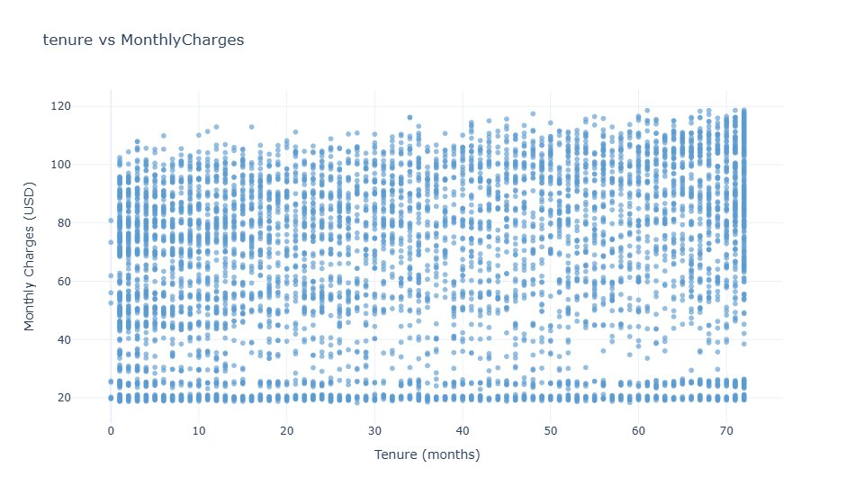
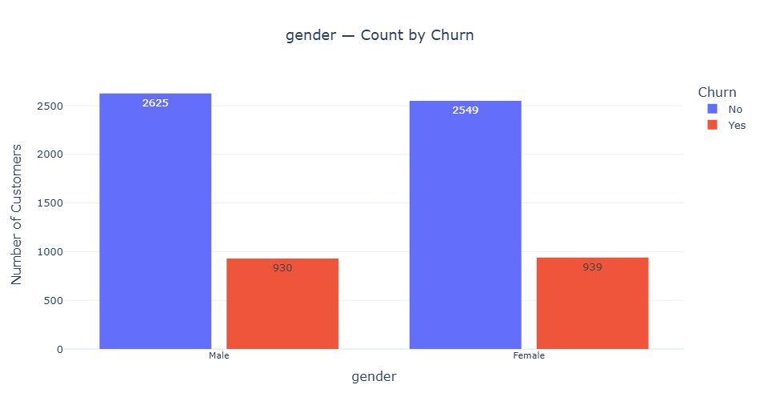
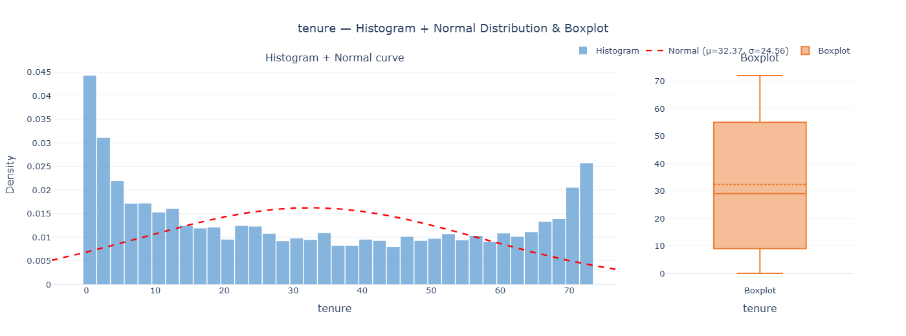

# 📊 Customer Churn — Exploratory Data Analysis (EDA)

## 📌 Project Overview

This project performs an in-depth **Exploratory Data Analysis (EDA)** on a Customer Churn dataset. The goal is to understand customer behavior, identify patterns related to churn, and extract meaningful insights from the data through visualizations.

---

## 📂 Dataset Features

The dataset includes key numerical and categorical features such as:
- **tenure** — Number of months the customer has stayed with the company
- **MonthlyCharges** — The amount charged to the customer monthly
- **TotalCharges** — The total amount charged to the customer
- **gender** — Customer gender (Male / Female)
- **Churn** — Whether the customer churned (Yes / No)

---

## 📈 Visualizations

### 1. 🔥 Correlation Heatmap of Numerical Features

> This heatmap shows the correlation between the three numerical features: **tenure**, **MonthlyCharges**, and **TotalCharges**.  
> - **tenure & TotalCharges** have the strongest correlation (**0.83**), meaning long-term customers tend to accumulate higher total charges.  
> - **MonthlyCharges & TotalCharges** also show a moderate-strong correlation (**0.65**).  
> - **tenure & MonthlyCharges** have a weak correlation (**0.25**), suggesting monthly pricing is relatively independent of how long a customer stays.

---

### 2. 🔵 Tenure vs Monthly Charges (Scatter Plot)

> This scatter plot explores the relationship between **tenure (months)** and **MonthlyCharges (USD)**.  
> - Monthly charges appear to be **spread across all tenure ranges**, indicating no strong linear trend.  
> - Customers at all tenure levels can have both high and low monthly charges, suggesting pricing is driven by plan type rather than loyalty duration.

---

### 3. 📊 Gender — Count by Churn

> This bar chart compares churn rates across **Male** and **Female** customers.  
> - **Male**: 2,625 stayed (No Churn) vs. 930 churned (Yes)  
> - **Female**: 2,549 stayed (No Churn) vs. 939 churned (Yes)  
> - The churn rate is **nearly identical** between genders (~26%), indicating that **gender is not a significant predictor of churn**.

---

### 4. 📉 Tenure — Histogram + Normal Distribution & Boxplot

> This combined chart shows the **distribution of tenure** among customers.  
> - The histogram reveals a **bimodal-like distribution**: a large spike at very low tenure (new customers) and another spike around 70 months (long-term customers).  
> - The data **does not follow a normal distribution** (μ=32.37, σ=24.56), as confirmed by the red dashed normal curve.  
> - The **boxplot** shows the median tenure is around **29–32 months**, with a wide interquartile range, reflecting high variability in customer lifetimes.

---

## 🛠️ Tools Used

- **Python** 🐍
- **Pandas** — Data manipulation
- **Plotly** — Interactive visualizations

---

## 💡 Key Insights

- Long-tenure customers accumulate significantly higher total charges.
- Gender has no meaningful impact on customer churn.
- Monthly charges vary widely regardless of how long a customer has been subscribed.
- A large portion of churn happens early in the customer lifecycle (low tenure), highlighting the importance of early customer retention strategies.
